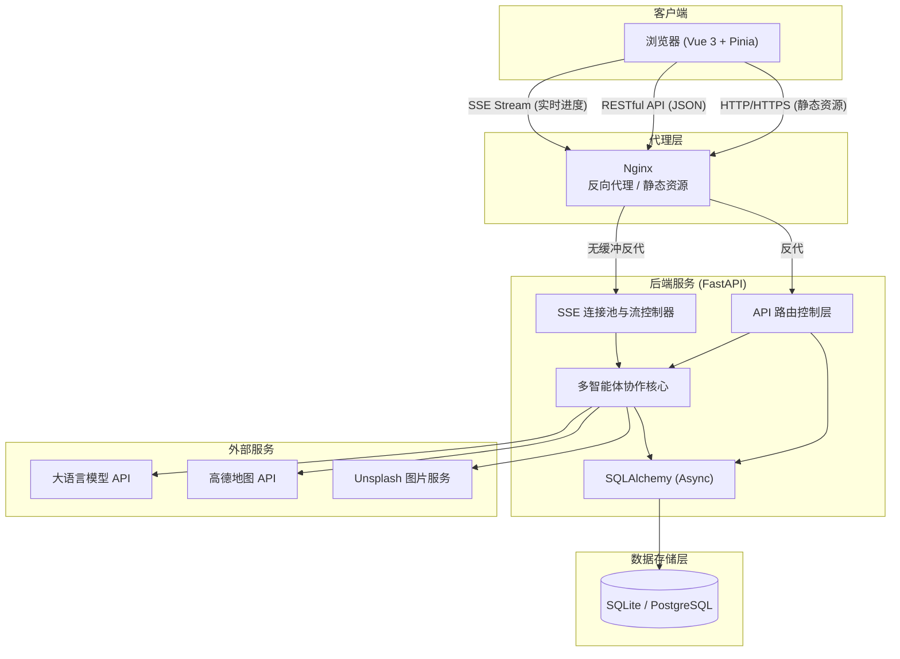
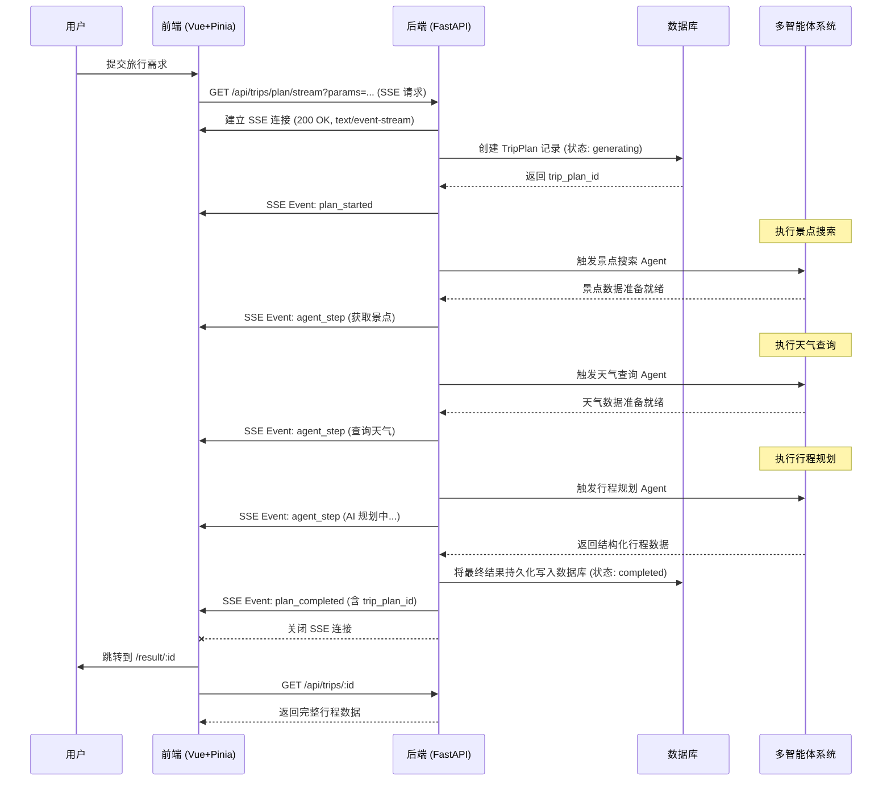
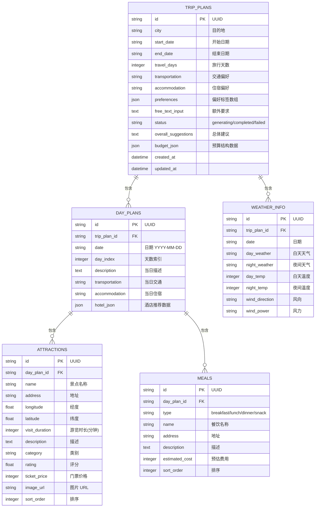

# HelloAgents 智能旅行助手 — 产品需求文档 (PRD)

> **文档类型**: 生产级多智能体全栈应用需求与设计文档
> **技术栈**: FastAPI + Vue 3 + Pinia + SQLAlchemy (Async) + Docker + HelloAgents + 高德地图 API + Unsplash API

---

## 一、产品概述

### 1.1 产品定位
智能旅行助手是一款**生产级环境可落地的全栈智能应用**。应用基于 HelloAgents 多智能体协作（Multi-Agent）框架与高德地图 API/MCP 的实时数据交互能力，配合后端关系型数据库持久化和 **SSE（Server-Sent Events）流式响应**，为用户提供智能、实时、可修改、可持久化的全流程旅行规划服务。

### 1.2 核心功能目标
1. **智能规划生成**：基于大语言模型与多智能体分工协作，根据目的地、日期、交通方式、住宿偏好及个性化需求自动生成每日行程、餐饮推荐、天气预报与预算汇总。
2. **SSE 流式反馈**：通过 Server-Sent Events 实现长时 AI 规划任务的实时进度推送与日志展示，消除等待焦虑。
3. **数据持久化与管理**：自动将生成的旅行计划完整写入数据库，提供历史行程档案页面，支持分页查看、详情分享与记录删除。
4. **行程交互编辑**：用户可在结果页面对景点、餐饮及预算进行二次编辑并实时保存回写数据库。

---

## 二、系统架构与时序设计

### 2.1 整体架构图



### 2.2 SSE 流式生成时序图



### 2.3 项目目录结构

```text
trip-planner/
├── backend/
│   ├── app/
│   │   ├── api/                  # API 路由层 (trips, poi, map)
│   │   ├── config.py             # 系统配置管理
│   │   ├── db/                   # 数据库连接与 ORM 模型
│   │   │   ├── session.py        # SQLAlchemy 异步 Engine 与 Session
│   │   │   └── models.py         # 关系型数据库模型
│   │   ├── models/               # Pydantic 校验与数据交互模型
│   │   ├── agents/               # 多智能体核心逻辑 (含进度回调)
│   │   ├── crud/                 # 数据库操作逻辑 (trips CRUD)
│   │   └── services/             # 外部服务 (AMap, Unsplash, LLM)
│   ├── alembic/                  # 数据库迁移脚本目录
│   ├── alembic.ini               # Alembic 配置文件
│   ├── run.py                    # 后端服务启动入口
│   └── requirements.txt          # Python 依赖清单
├── frontend/
│   ├── src/
│   │   ├── components/           # 通用 UI 组件 (GlassIcon, TripMap, AppNav)
│   │   ├── services/             # API 请求与 SSE 连接服务
│   │   ├── stores/               # Pinia 全局状态管理 (useTripStore)
│   │   ├── styles/               # 设计系统与样式 (glass.css)
│   │   ├── views/                # 页面视图 (Home, History, Result)
│   │   └── types/                # TypeScript 类型定义
│   ├── index.html                # 入口 HTML
│   └── vite.config.ts            # Vite 构建配置
├── docker/                       # 容器化构建配置
│   ├── backend.Dockerfile
│   └── frontend.Dockerfile
├── nginx/                        # Nginx 配置
│   └── default.conf
└── docker-compose.yml            # Docker 容器编排文件
```

---

## 三、技术栈与依赖规范

### 3.1 后端技术栈
- **核心框架**: FastAPI
- **数据库及 ORM**: `SQLAlchemy>=2.0` (异步模式), `aiosqlite` / `asyncpg`, `alembic` (数据迁移)
- **SSE 流传输**: `sse-starlette`
- **HTTP 客户端**: `httpx`, `requests`
- **运行环境**: Python 3.11+

### 3.2 前端技术栈
- **核心框架**: Vue 3 (Composition API `<script setup>`)
- **状态管理**: Pinia
- **路由管理**: Vue Router 4
- **UI 组件库**: Ant Design Vue + 深度定制毛玻璃 CSS 设计系统
- **网络请求**: Axios + 原生 EventSource

### 3.3 基础设施
- **反向代理**: Nginx
- **容器化**: Docker & Docker Compose

---

## 四、数据库设计与 CRUD 架构

### 4.1 ER 图与表结构



### 4.2 数据库机制说明
- **级联删除**: 配置 `cascade="all, delete-orphan"`，删除 `trip_plans` 记录时自动清空所含的所有每日计划、景点、餐饮及天气数据。
- **状态追踪**: `status` 初始为 `generating`，生成完成转为 `completed`，异常转为 `failed`。

---

## 五、SSE 流式通信设计

### 5.1 事件类型规范

| Event 名称 | 触发时机 | Payload 数据内容 | 前端处理逻辑 |
|-----------|---------|-----------------|-------------|
| `plan_started` | 建立连接并创建数据库记录后 | `{ "trip_plan_id": "uuid" }` | 记录行程 ID，展开生成进度面板 |
| `agent_step` | Agent 开始新步骤或更新状态时 | `{ "step_name": "获取天气", "status": "running/done", "message": "..." }` | 实时更新步骤指示器与进度动画 |
| `plan_completed` | 行程生成并成功持久化数据库后 | `{ "trip_plan_id": "uuid" }` | 结束加载，自动跳转至结果页 `/result/:id` |
| `plan_failed` | 遇到不可恢复的异常时 | `{ "error_code": "GENERATION_FAILED", "message": "..." }` | 停止进度，显示错误提示并允许重试 |
| `heartbeat` | 后端每 15 秒定期发送 | `{ "status": "alive" }` | 维持长连接，防止超时断开 |

---

## 六、API 接口规范

所有的 RESTful API 挂载在 `/api` 前缀下。

### 6.1 接口列表

| HTTP 方法 | 请求路径 | 功能描述 |
|-----------|---------|----------|
| `GET` | `/api/trips/plan/stream` | 提交规划请求并建立 SSE 实时流（参数以 URL-encoded JSON Query 传递） |
| `GET` | `/api/trips` | 获取历史行程列表（支持分页 `?page=1&size=10`） |
| `GET` | `/api/trips/{trip_id}` | 获取指定行程详情数据 |
| `PUT` | `/api/trips/{trip_id}` | 更新行程内容（保存编辑结果） |
| `DELETE` | `/api/trips/{trip_id}` | 删除指定行程记录 |
| `GET` | `/api/poi/photo` | 查询指定景点的 Unsplash 图片 URL |
| `GET` | `/api/map/route` | 查询高德地图两点间的路线规划（支持步行/驾车/公共交通） |

### 6.2 统一响应格式与分页规范
```json
{
  "success": true,
  "data": { ... },
  "error": null,
  "meta": {
    "page": 1,
    "size": 10,
    "total": 42,
    "total_pages": 5
  }
}
```

---

## 七、多智能体协作与图片容错补全

### 7.1 Agent 进度回调与数据整合
- 在行程生成过程中，多智能体系统通过回调函数向异步事件队列推送状态。
- 行程规划完成后，整理所有景点、天气、酒店及预算数据，统一写入数据库。

### 7.2 Unsplash 图片双向补全与持久化
1. **生成时补充**：Agent 生成行程时调用 Unsplash API 为景点匹配图片 URL。
2. **降级与延迟补全**：若生成阶段图片抓取失败，不影响行程主流程。
3. **前端补全与自动回写**：用户打开结果页时，前端自动检测缺失图片的景点并异步发起补充请求，获取成功后调用 `PUT /api/trips/{id}` 将包含新图片 URL 的行程回写至数据库，避免后续重复调用图片 API。

---

## 八、前端功能与 UI/UX 规格

### 8.1 页面路由与 Pinia 状态管理
- **`/` (Home.vue)**：需求输入表单与 SSE 实时进度展示。
- **`/history` (History.vue)**：历史行程档案，响应式 4 列卡片网格布局，带有状态标签、删除二次确认及分页控制。
- **`/result/:id` (Result.vue)**：展示行程路线图、每日日程、天气及费用预算，支持编辑修改与图片自动补全。

### 8.2 视觉系统与交互动效
- **Design System**：基于 Glassmorphism 毛玻璃风，使用深色高质感配色。
- **艺术字体**：关键大标题（如首页“下一站，说走就走”与历史页“历史行程”）采用中文书法字体 **站酷小薇体 (ZCOOL XiaoWei)**。
- **排版与动效**：标题与内容配合 `lineUp`（滑入）、`wipeRight`（右展）、`wipeDown`（下揭）依次进场的平滑微动效。

---

## 九、部署与容器化架构

### 9.1 Docker Compose 部署配置

在生产环境中提供 `backend`, `frontend`, `postgres`, `nginx` 服务编排。

### 9.2 Nginx 代理与 SSE 特殊配置

```nginx
server {
    listen 80;

    location / {
        root /usr/share/nginx/html;
        index index.html;
        try_files $uri $uri/ /index.html;
    }

    location /api/trips/plan/stream {
        proxy_pass http://backend:8000;
        proxy_buffering off;             # 必须：禁用缓冲
        proxy_cache off;                 # 必须：禁用缓存
        proxy_set_header Connection '';  # 保持长连接
        proxy_http_version 1.1;
        chunked_transfer_encoding off;
        proxy_read_timeout 300s;         # 设置足够读超时
    }

    location /api/ {
        proxy_pass http://backend:8000;
        proxy_set_header Host $host;
    }
}
```

---

## 十、安全与可靠性策略

1. **输入校验**：使用 Pydantic 对城市名称、日期格式、天数范围做严格校验。
2. **统一异常捕获**：全局捕获后端与智能体异常，输出标准 JSON 错误格式。
3. **断连防护与心跳**：SSE 传输中 15 秒定时下发 `heartbeat`，防止 Nginx / 网关误切断连接。
